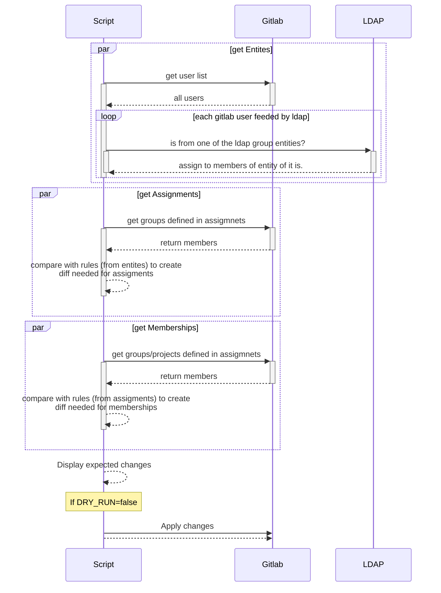

# Ldap Assign Groups

Way to synchronize ldap users/groups with gitlab groups

This reads rules defined in `policy-rules.yml` and tries to reconcile each assigments / memberships with the real state of gitlab.

## Run policy

### Scheduled

Configured in `Build / Pipeline Schedule` to run every hour.

Using variables:
```
ACTION:     RUN_APPLY
SKIP_BUILD: true
```

> Nb: you can run this  manually if waiting for an hour is too long by using the web intereface

### On commits / MR

When updating these files: `src/**` or `Dockerfile` or `.gitlab-ci.yml` the docker image will be rebuilded in every following options

#### Feature branch on merge request

if changes on `policy-rules.yml`, runs a plan

> NB: when a MR is merged, what was planned on the previous pipeline will be applied

#### `main` branch

Runs an apply on every commit if changes on `policy-rules.yml`

### Run locally

required env variable con be found in `.env.example` file 

```sh
set -o allexport
source .env.example
set +o allexport
```

then run script 
```sh
npm i
node ./src/index.mjs
```

## Setting rules

Rules are defined by 3 different blocks:
- `entities` are the initial element and can be of 2 differnt types
  - ldap group
  - gitlab user
- `assigments` are gitlab groups where you link entities with them, this can be understood as access registry
- `memberships` are gitlab groups or project where you link assigments (gitlab-groups in fact)

### Example

```yml
entities:
  prodOperators:
    provider: ldap
    kind: group
    # Full DN of a LDAP group
    selector: CN=Prod-Operator,OU=Groups,DC=example,DC=net 
  root:
    provider: gitlab
    kind: user
    # Username of a gitlab user
    selector: root

assignments:
  admins:
    kind: group # can only be group..
    path: access/gitlab-admin # full path of the group
    entities:
      OWNER: # Can be DEVELOPER or GUEST as well
        - root # name of entity
      MAINTAINER:
        - prodOperators # name of entity

memberships:
  efr:
    kind: project # either project or group
    path: packages/efr # full path of gitlab
    assignments:
      MAINTAINER:
        - admins
      DEVELOPER:
        - operators
  terraform:
    kind: group
    path: terraform
    assignments:
      OWNER:
        - admins
```


## Env variables

### Inside the script

You can find all env variable and their default value on [src/config.mjs](src/config.mjs#L26).

Just some useful one:
- set debug log level: `LOG_LEVEL=0`
- Disable dry run: `DRY_RUN=false`

### Gitlab-ci

Some useful env variable used only for gitlab ci:
- Skip build docker image: `SKIP_BUILD=true`
- Force build docker image: `FORCE_BUILD=true`
- Force action: `ACTION={RUN_PLAN,RUN_APPLY}`

## Example of applying run

```log
$ DRY_RUN=false node src/index.mjs
[INFO] Planned assignments changes:
[INFO]   For admins (access/gitlab-admin)
[INFO]     + [user] with access level DEVELOPER
[INFO]     ~ [user2] with access level DEVELOPER => MAINTAINER
[INFO]     - root (OWNER)
[INFO]   For operators (access/gitlab-contributor)
[INFO]     + [user3] with access level MAINTAINER
[INFO]     + [user1] with access level MAINTAINER
[INFO]     + [user4] with access level MAINTAINER
[INFO] Planned memberships changes:
[INFO]   For efr (packages/efr)
[INFO]     + access/gitlab-admin with access level MAINTAINER
[INFO]     + access/gitlab-contributor with access level DEVELOPER
[INFO]   For aws (terraform/aws)
[INFO]     + access/gitlab-admin with access level OWNER
[INFO]     ~ access/gitlab-contributor with access level DEVELOPER => MAINTAINER
[INFO]   For terraform (terraform)
[INFO]     + access/gitlab-admin with access level OWNER
[INFO]
[INFO] Applying changes...
```

## Sequence diagram

